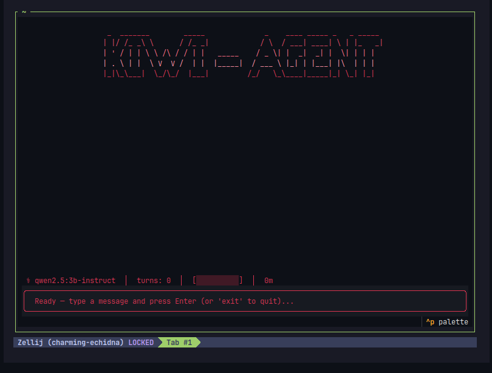
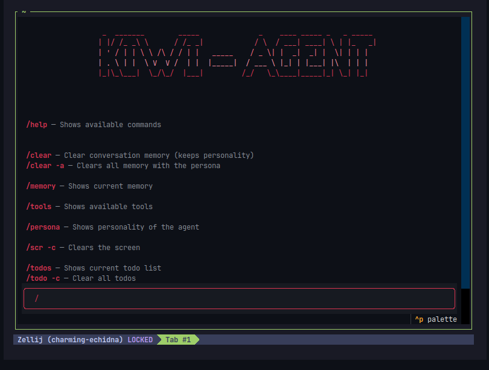
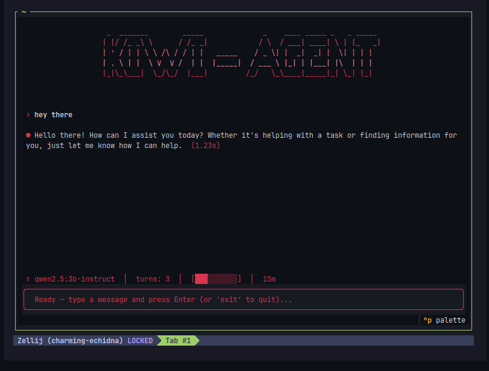

# Kiwi Agent

Kiwi is a local, tool-using AI agent that runs entirely on your machine via [Ollama](https://ollama.com). It can read/write files, manage folders, run shell commands, search the web, execute Python, and keep track of to-dos — all through natural conversation, with confirmation prompts before anything destructive or potentially risky.

## Features

- **File operations** — read, write, rename, copy, and move files
- **Python execution** — run Python code on demand
- **Folder management** — create folders, open tabs in your file manager/shell
- **Shell commands** — run shell commands with an explicit confirmation step before execution
- **Web search** — pull in information from the web mid-conversation
- **To-do tracking** — add, list, and clear to-dos as part of a task
- **Clarifying questions** — the agent can pause and ask you a follow-up question when a request is ambiguous
- **Safe deletions** — file deletion requires an explicit "are you sure?" confirmation
- **Streaming responses** — see the model's thinking and answer stream in as it's generated

## How it works

Kiwi is built around a simple agent loop (`Agent.run_turn`):

1. Your message is added to the conversation history.
2. The agent calls a local Ollama model with the full conversation and a defined set of tools.
3. The model's response streams back — both its internal "thinking" and its final answer are surfaced live.
4. If the model wants to use a tool (e.g. `write_file`, `run_shell_command`, `web_search`), Kiwi dispatches the call to the matching handler.
5. Some tools (deleting a file, running a shell command) pause and ask you to confirm before proceeding.
6. The tool's result is fed back into the conversation, and the loop repeats until the model produces a final answer with no further tool calls.

## Models

Kiwi is configured to work with local models pulled through Ollama:

```python
MODELS = [
    "qwen2.5:3b-instruct",
    "qwen3:4b",

    # Feel free to delete and add your own models here.
]
```

By default, the first model in the list is used. Make sure your chosen model is pulled locally:

```bash
ollama pull qwen2.5:3b-instruct
```

## Installation

Kiwi uses [uv](https://docs.astral.sh/uv/) for dependency management, so setup is a single command.

```bash
# Clone the repository
git clone https://github.com/i-llu/DataEngineering.git
cd agent

# Install dependencies (creates the .venv automatically)
uv sync

# Make sure Ollama is installed and running
ollama serve
```

## Usage

Once installed, run Kiwi with:

```bash
uv run kiwi
```

Or, if you've activated the `.venv` yourself (`source .venv/bin/activate`), just:

```bash
kiwi
```

This launches the agent, ready to accept natural-language requests such as:

- "Summarize the contents of `notes.txt`"
- "Create a folder called `reports` and move all `.csv` files into it"
- "Search the web for the latest Ollama release notes"
- "Add a to-do: refactor the tools service"

When the agent needs to run a shell command or delete a file, it will ask you to confirm before proceeding.

## Project Structure

```
agent/
├── src/
│   └── app/
│       ├── main.py           # CLI entry point
│       ├── agent.py          # Core agent loop and tool dispatch
│       ├── toolsService.py   # Aggregates file/folder/shell/web/todo
│       └── tools_schema.py   # Tool schema definitions passed to the model
├── pyproject.toml            # Project metadata and dependencies (uv)
├── uv.lock                   # Locked dependency versions
└── .venv/                    # Local virtual environment (created by `uv sync`)
```

## Requirements

- Python 3.10+
- [uv](https://docs.astral.sh/uv/) for dependency management
- [Ollama](https://ollama.com) installed and running locally
- One or more of the supported models pulled locally

## Screenshots






## Notes

- **Token usage tracking is currently mocked.** The numbers shown for token usage do not reflect real consumption yet — this is a placeholder and not yet wired up to actual usage data.

- **Personality*** You can always change system prompt -> src/tools/commands.py

## Roadmap / Ideas

- [ ] Configurable default model (instead of always using `MODELS[0]`)
- [ ] Persistent conversation history across sessions
- [ ] Additional tool integrations
- [ ] Real token usage tracking (currently mocked)


## License

This project is licensed under the terms in [AGPL-3.0-or-later](./LICENSE.txt).